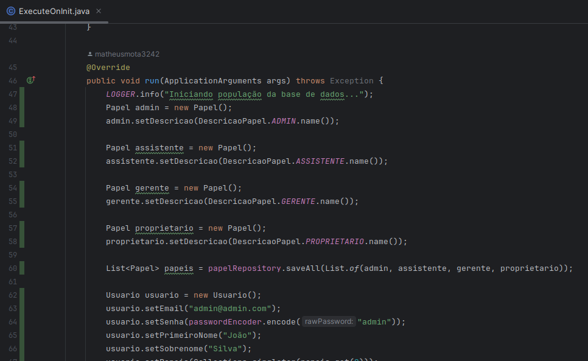
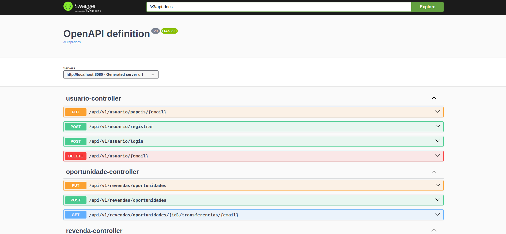
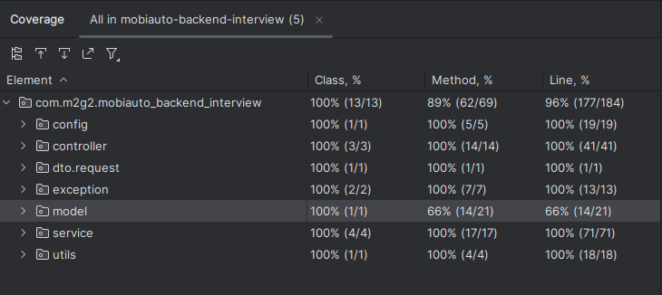

# mobiauto-backend-interview

Sistema de gerenciamento de revendas de veículos desenvolvido para atender os requisitoos presentes no desafio de backend da Mobiauto, conforme documentação enviada.

Esse sistema foi desenvolvido utilizando as versões Java 17 e Spring Boot 3.

## Pré-requisitos

- Java 17
- Maven
- Docker

## Banco de dados
A fim de facilitar a execução do projeto, foi utilizado um banco de dados em memória H2. O banco de dados é populado com dados iniciais ao iniciar a aplicação.



## Dependências

- **spring-boot-starter-data-jpa**: utilizado para persistência de dados
- **spring-boot-starter-web**: utilizado para criação de APIs REST
- **spring-boot-starter-security**: utilizado para segurança da aplicação
- **spring-boot-starter-validation**: utilizado para validação de dados
- **h2**: utilizado para banco de dados em memória
- **spring-boot-starter-test**: utilizado para testes unitários
- **spring-boot-security-test**: utilizado para testes de segurança
- **springdoc-openapi-starter-webmvc-ui**: utilizado para documentação da API
- **jjwt-api**: utilizado para geração de tokens JWT
- **jjwt-impl**: utilizado para geração de tokens JWT
- **jjwt-gson**: utilizado para geração de tokens JWT

## Execução

1. Clone o repositório
2. Execute o comando `cd mobiauto-backend-interview`
3. Execute o comando `mvn clean package` na raiz do projeto
4. Execute o comando `docker compose up --build -d` e o serviço estará rodando na porta 8080

## Documentação da API

- **Swagger**: estando o sistema rodando na porta 8080. Acesse o endereço a seguir para visualizar o Swagger da API.
```
http://localhost:8080/swagger-ui.html
```


- **Postman**: importe o arquivo `postman/mobiauto.postman_collection.json` para o Postman e utilize as requisições disponíveis.

## Testes

Os testes unitários da aplicação foram realizados com o uso Junit 5 e Mockito. Para executar os testes, execute o comando `mvn test` na raiz do projeto.

O sistema encontra-se com cobertura de 100% em todas as classes que implementam regras de negócio.

